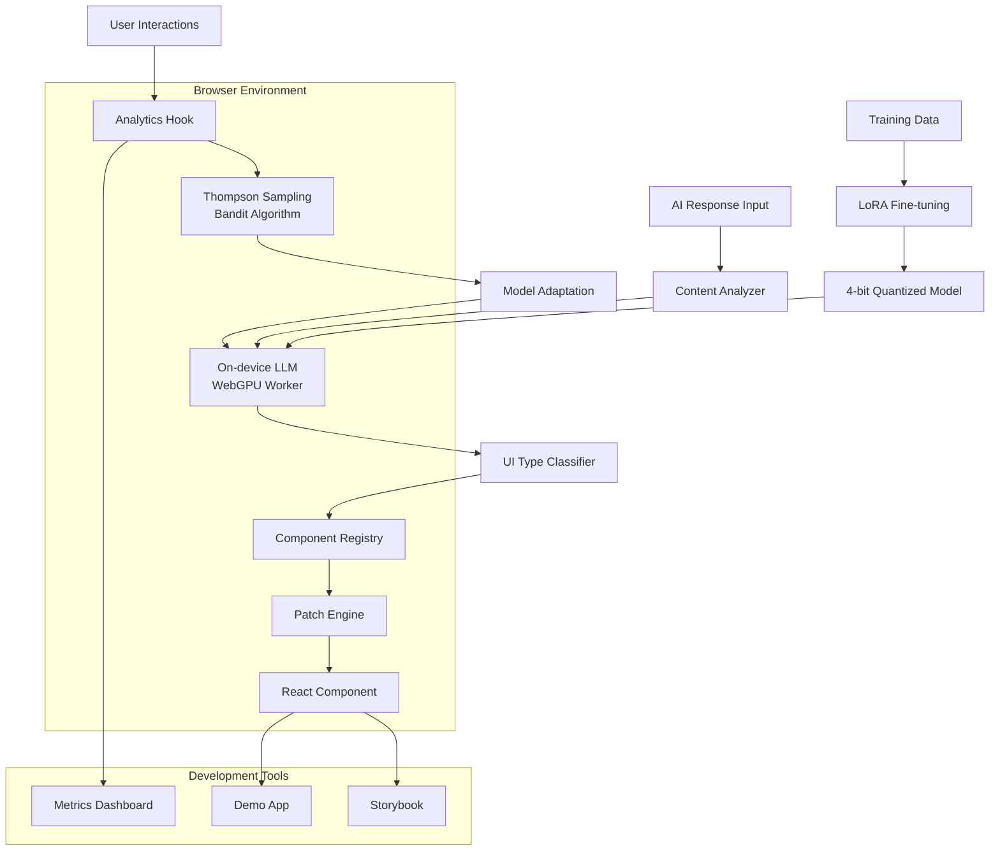

# PivotUI

> **Intelligente UI-adaptatie voor AI-antwoorden via on-device LLM**

PivotUI is een revolutionaire React/TypeScript-toolkit die automatisch de optimale gebruikersinterface-vorm selecteert voor AI-gegenereerde antwoorden. Door gebruik te maken van een on-device Large Language Model (LLM) via WebGPU, analyseert PivotUI de inhoud, context en gebruikersvoorkeuren om real-time te bepalen of een antwoord het beste gepresenteerd kan worden als tekst, tabel, grafiek, kaart, lijst, formulier of een van de vele andere UI-componenten.

In plaats van ontwikkelaars te dwingen om handmatig UI-keuzes te maken of gebruikers te laten worstelen met suboptimale presentaties, automatiseert PivotUI dit proces volledig. De toolkit gebruikt een getraind model dat leert van duizenden geannoteerde voorbeelden om patronen te herkennen in AI-antwoorden en deze te matchen met de meest effectieve visuele representatie.

Het systeem werkt volledig client-side, waardoor privacy gewaarborgd is en latency geminimaliseerd wordt. Door gebruik te maken van Thompson Sampling en een bandit-loop leert PivotUI continu van gebruikersinteracties om zijn keuzes te verfijnen en personaliseren per gebruiker.

## Features

- 🧠 **On-device LLM inference** via WebGPU voor privacyvriendelijke UI-selectie
- ⚡ **Real-time adaptatie** zonder server-roundtrips of latency
- 🎯 **25+ UI-component types** in uitgebreide ontologie (tekst, tabellen, grafieken, maps, etc.)
- 🔄 **Hot-swap patch engine** voor naadloze component-updates zonder React remounts
- 📊 **Thompson Sampling bandit** voor continue optimalisatie en personalisatie
- 🎨 **Volledig customizable** React-componenten met TypeScript types
- 📈 **Analytics & metrics dashboard** voor performance tracking
- 🔧 **Plug-and-play integratie** met bestaande React-applicaties
- 🏃 **Zero-latency switching** tussen chat en PivotUI-modus
- 🎪 **Storybook integration** met 15+ component-varianten
- 🧪 **Uitgebreid getest** met Vitest en React Testing Library

## Roadmap / TODO's

### Core Functionaliteit
- [ ] UI-ontologie definiëren (≥ 25 component types: text, table, chart, map, list, form, card, timeline, tree, gallery, etc.)
- [ ] Prompt-engineering & few-shot voorbeelden opstellen voor LLM-training
- [ ] Dataset annoteren (≥ 2k synthetische AI-antwoorden met optimale UI-labels)
- [ ] LoRA fine-tuning implementeren & 4-bit quantisatie (TinyLlama ≈ 100M parameters)

### Technical Implementation  
- [ ] WebGPU-build implementeren in `packages/worker` voor browser-inference
- [ ] React patch-engine ontwikkelen voor hot-swap zonder component remount
- [ ] Thompson Sampling bandit-loop & analytics hook implementeren
- [ ] Metrics-dashboard bouwen (Next.js page met real-time data)

### Development & Demo
- [ ] Demo-app integreren met toggle tussen chat ↔ PivotUI modus
- [ ] Unit- & integration-tests opzetten (Vitest + React Testing Library)
- [ ] CI-workflow configureren (pnpm → build + test + lint)
- [ ] Storybook setup met ≥ 15 component-varianten

### Documentation & Deployment
- [ ] Docs-site opzetten (Docusaurus) met API-referentie
- [ ] Architectuur Decision Records (ADR's) schrijven
- [ ] Performance benchmarks & case studies documenteren
- [ ] Community contributing guidelines opstellen

## Architectuur-overzicht

PivotUI gebruikt een gedistribueerde architectuur met client-side ML-inference, React-gebaseerde UI-components en een intelligente patch-engine voor naadloze transitions.



Het systeem werkt in drie hoofdfasen:
1. **Content Analysis**: AI-antwoorden worden geanalyseerd op inhoud, structuur en context
2. **ML Classification**: Een on-device LLM bepaalt de optimale UI-component type
3. **Dynamic Rendering**: De patch-engine update de UI zonder React remounts voor vlotte UX

## Installatie & Quick Start

```bash
# Installeer PivotUI in je React project
npm install @pivotui/react @pivotui/worker

# Of met pnpm
pnpm add @pivotui/react @pivotui/worker
```

**Basis gebruik:**

```typescript
import { PivotUIProvider, usePivotUI } from '@pivotui/react';

function App() {
  return (
    <PivotUIProvider>
      <ChatInterface />
    </PivotUIProvider>
  );
}

function ChatInterface() {
  const { adaptiveRender } = usePivotUI();
  
  const handleAIResponse = (response: string) => {
    return adaptiveRender(response, {
      fallback: 'text',
      enableAnalytics: true
    });
  };
  
  return (
    <div>
      {/* Je chat UI hier */}
    </div>
  );
}
```

**Development setup:**

```bash
# Clone de repository
git clone https://github.com/yourusername/pivotui.git
cd pivotui

# Installeer dependencies
pnpm install

# Start development server
pnpm dev

# Run tests
pnpm test

# Build voor productie
pnpm build
```

## Project-structuur

```
pivotui/
├─ .github/workflows/     # CI/CD pipelines (GitHub Actions)
├─ packages/
│  ├─ worker/            # WebGPU LLM worker voor browser inference
│  ├─ react/             # React component registry + patch engine
├─ examples/demo-app/    # Next.js demo applicatie
├─ docs/                 # Ontwerpbeslissingen, ADR's, API-referentie
├─ schema/               # JSON Schema's voor UI-ontologie definitie
├─ data/                 # Geannoteerde training samples & datasets
└─ LICENSE               # MIT licentie
```

**Package details:**
- `packages/worker`: Bevat de WebGPU-geoptimaliseerde LLM worker, model loading, en inference engine
- `packages/react`: De hoofdbibliotheek met React hooks, components, patch engine en TypeScript types
- `examples/demo-app`: Volledige demo-applicatie die alle PivotUI-functies showcaset
- `docs/`: Documentatie inclusief API-referentie, best practices en architectuur-beslissingen
- `schema/`: JSON Schema definities voor de UI-ontologie en component-types
- `data/`: Training data, geannoteerde voorbeelden en benchmark datasets

## Contributing

We verwelkomen bijdragen aan PivotUI! Volg deze richtlijnen:

**Conventional Commits:**
- `feat:` nieuwe functionaliteit
- `fix:` bug fixes  
- `docs:` documentatie updates
- `style:` code formatting
- `refactor:` code restructuring
- `test:` test toevoegingen
- `chore:` build/dependency updates

**Code Style:**
- Gebruik TypeScript voor alle nieuwe code
- Volg functionele React patterns met hooks
- Voeg JSDoc-commentaar toe aan publieke functies
- Gebruik `const` declaraties in plaats van `function`
- Bij meerdere parameters: gebruik object destructuring
- Voeg unit tests toe voor nieuwe functionaliteit

**Development Workflow:**
1. Fork de repository
2. Maak een feature branch: `git checkout -b feat/nieuwe-feature`
3. Commit met conventional commits: `git commit -m "feat: add new UI component type"`
4. Push naar je fork: `git push origin feat/nieuwe-feature`
5. Open een Pull Request met uitgebreide beschrijving

**Code Review Process:**
- Alle PR's vereisen minimaal één review
- CI checks moeten slagen (lint, test, build)
- Nieuwe features vereisen documentatie updates
- Breaking changes vereisen major version bump

## Licentie

PivotUI is uitgebracht onder de MIT License. Dit betekent dat je vrij bent om de software te gebruiken, modificeren, distribueren en verkopen, zowel voor commerciële als niet-commerciële doeleinden. De enige vereiste is dat je de originele copyright notice en license disclaimer behoudt.

Voor de volledige licentietekst, zie het [LICENSE](LICENSE) bestand in deze repository.

---

**Gemaakt met ❤️ door de PivotUI community**
